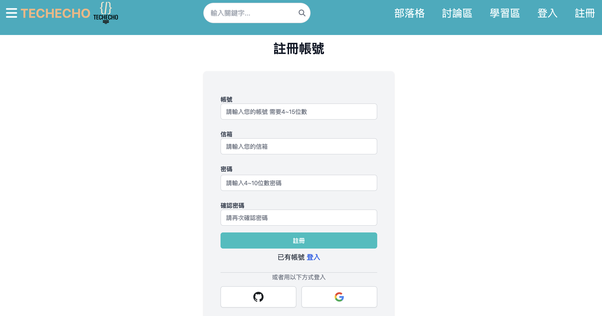
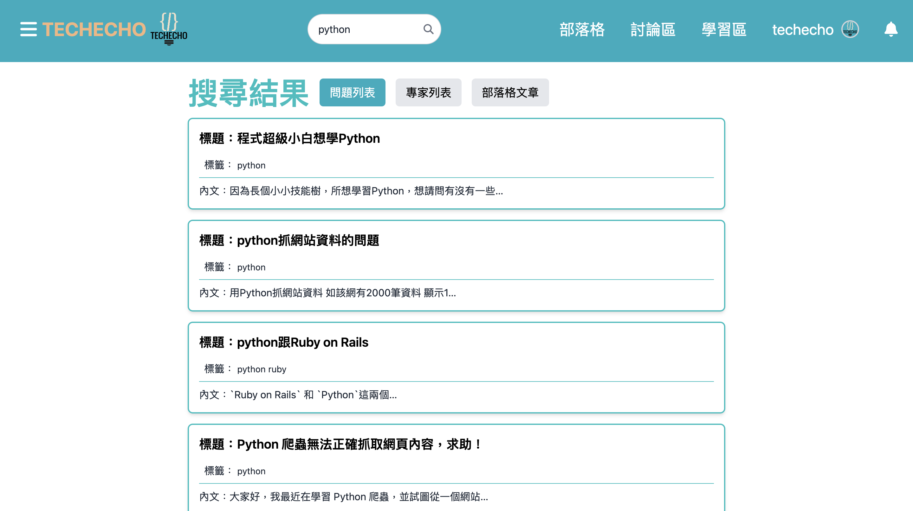
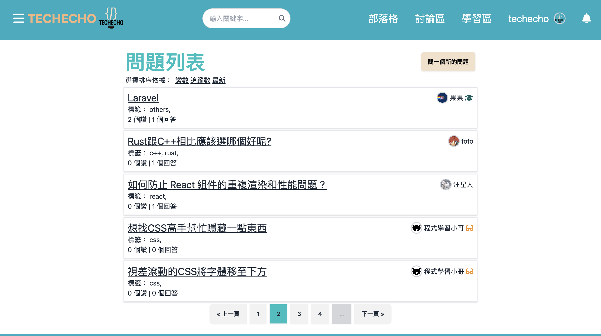
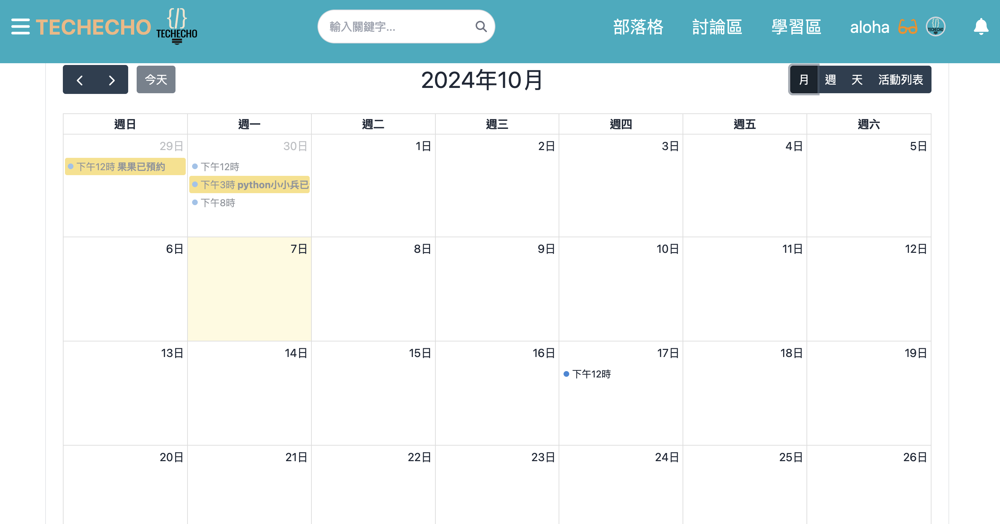
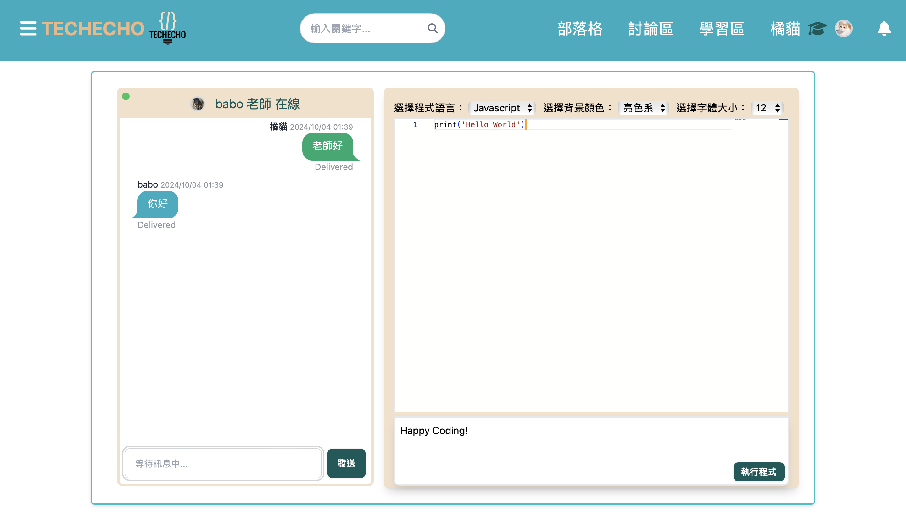
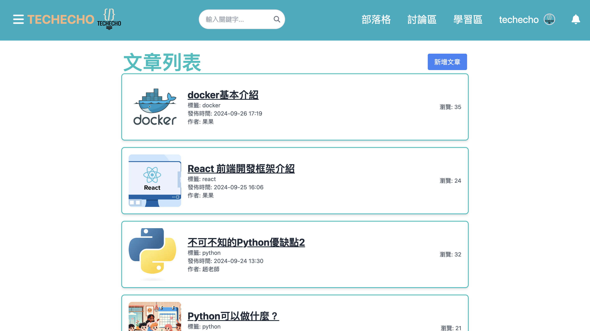
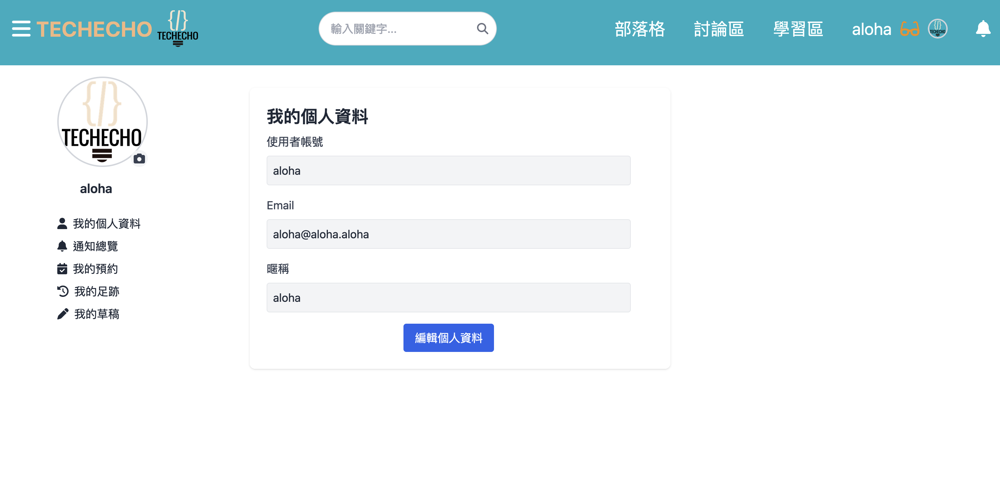

# TechEcho

 
TechoEcho 是專為軟體開發者設計的技術交流平台，除了提供問答與知識分享，還能預約專家進行深入諮詢，並鼓勵專家與學習者發表技術文章，促進社群成長與技術交流

<h4 align="center">

找飯店？ Trivago 

 找答案？ TechEcho

</h4>

  <a href="https://www.tech-echo.dev/" target="_blank">專案網址</a>
  <a href="https://www.youtube.com/watch?v=NSOQoZuHBFk" target="_blank">介紹影片</a>
  <a href="https://drive.google.com/file/d/1QIZvKJ1NbB0K-bkc4kffivPBkprE70hH/view" target="_blank">介紹簡報</a>

## 功能說明

### 1. 註冊登入：

進入 TechEcho ，若要發問、留言、發表技術文章請點擊註冊按鈕並登入。  

 

#### 註冊與登入功能

- 第三方平台登入 (GitHub, Google)
- 註冊後自動登入
- 登入後跳轉到原來畫面

#### 2. 搜尋疑問：

搜尋關鍵字，可找出想要的問題、專家、部落格文章。  

 

##### 搜尋功能

- 搜尋關鍵字
- 標籤篩選
- 即時結果顯示

#### 3. 提問互動：

可以看到所有提出的問題，與提出個人疑問
 

 

##### 問題及留言功能：

- 支援 Markdown 語法
- 可預覽畫面
- 一鍵導引至作者個人頁面

#### 4. 成為專家：

成為專家可以與學生一對一的教學互動，以及可以排定自己的上課行程。
 

 

##### 預約功能：

- 利用月曆工具拖拉更改上課的時段
- 刪除上課的時間
- 已被預約會顯示聊天室

##### 專家功能：

- 顯示專家提過的問題與解答過的問題
- 可根據專業篩選專家
- 編輯專家檔案

#### 5. 成為 Premium 用戶：

升級成 Premium 用戶可以預約專家，利用聊天室以及共編與專家進行更深入的討論。

 

 

##### 聊天室功能：

- 即時溝通
- 上線提醒
- 延遲載入
- 限制人數

##### 共同編輯器：

- 即時共同編輯
- 支援 Javascript 與 Python 直譯
- 自定義背景與文字大小

##### 金流功能：

- 支援綠界支付與 LINE pay
- 安全的支付系統

#### 6. 技術分享：

可至部落格頁面發表技術文章。
 

 

##### 部落格功能

- 支援 Markdown 語法
- 可放封面照片
- 儲存草稿

#### 7. 檢視個人足跡

登入的使用者可點選大頭貼至個人簡介，檢視個人通知、預約、提問過和回答過的問題、發過的技術文章與儲存的文章草稿。
 

 

##### 會員功能

- 編輯暱稱及個人頭像
- 顯示過往的所有紀錄
- 顯示個人的預約時間
- 公開的個人頁面

##### 通知功能

- 即時通知
- 直接導引至相關問題

## 使用技術

- 前端：daisyUI, Tailwind CSS, Alpinejs, htmx, Vue
- 後端：Python, Django
- 資料庫：PostgreSQL
- 版本控制：Git
- 第三方登入：Google, GitHub
- 上傳照片：S3
- 部署：AWS EC2, ALB, Nginx(Web Server)
- ASGI Server：Daphne
- 通道層、快取：Redis
- 執行使用者的程式碼、確保資料庫與快取的部署環境：Docker
- 規劃：Miro, Google Sheets

## 團隊成員

- 林永欣 / Alex [GitHub](https://github.com/alextechtrek)

  - 第三方登入
  - 串接 LINE pay 金流
  - 製作部落格功能

- 許修福 [GitHub](https://github.com/buding033171)

  - 專家頁面新增/編輯
  - 專家列表與篩選功能
  - 專家檔案與答題紀錄
  - 串接聊天室

- 陳威辰 / Will [GitHub](https://github.com/Double-T1)

  - 一對一聊天室
  - 製作文字編輯器
  - 問題功能
  - 通知小鈴鐺

- 紀祥文 / Chi [GitHub](https://github.com/chixxyy)

  - UI/UX 設計
  - 搜尋功能
  - 動畫製作
  - 追蹤專案進度

- 林倩瑜 / Eudora [GitHub](https://github.com/imEudora)

  - 回答功能
  - 設計並串接日曆動態預約
  - 老師授課系統
  - 學生預約功能

- 洪芷儀 / Sabina [GitHub](https://github.com/sabina726)

  - 會員登入註冊
  - 個人資料修改
  - 會員在網站的紀錄
  - 公開的個人頁面

- 李彥賜 / Tony [GitHub](https://github.com/ttonylee)

  - 付款功能流程/資料庫設計
  - 串接整合第三方金流功能
  - 串接 AWS S3
  - 網站雲端部署

## 安裝環境

1. `poetry shell` 虛擬環境
2. `poetry install` 下載 python 相應套件
3. `npm install` 下載 html/css/js 相應套件
4. 使用`.env.example` 建立`.env`檔
5. cd 到 editors ，`docker build -t editor:latest .` 建立編輯器所需的 docker image

## 執行環境

1. `docker compose up -d` 架起 Redis 與 PostgreSQL
2. `npm run dev` 執行 Esbuild 和 Tailwind CSS 編譯
3. `make server` 開啟伺服器
